<i>Flowchart generated by a web crawler I coded that recursively explores the world news on [Straits Times](https://www.straitstimes.com/world) by following and querying anchor links found in each article, updated daily!</i>

<!-- START -->

<i>Last updated: 2025-02-22 16:51:21.239979 (GMT+8)</i>
<!-- END -->