```mermaid
%%{init: {'theme':'base', 'themeVariables': {'primaryColor': "transparent", 'primaryTextColor': "#F9F9F9", 'lineColor': "#20C20E", 'primaryBorderColor':'#20C20E'}}}%%
flowchart LR
classDef txtsize font-size:20px;

Pgitsahltnkldb@{ shape: win-pane, label: "_Published Dec 03, 2025, 03:21 AM_
Pentagon chief pete hegseth says us has ‘only just begun’ striking alleged drug boats" }
Uirdotoeramzsho@{ shape: win-pane, label: "_Published Dec 02, 2025, 04:09 AM_
Us admiral ordered follow-up strike on alleged drug boat from venezuela, says white house" }
UikperngutVura@{ shape: win-pane, label: "_Published Sep 03, 2025, 04:19 AM_
Us military kills 11 people in strike on alleged drug boat from venezuela, trump says" }
Ulfsrafapay@{ shape: win-pane, label: "_Published Aug 30, 2025, 03:43 AM_
Us builds up forces in caribbean as officials, experts, ask why" }
VuMoUswieggoy@{ shape: win-pane, label: "_Published Sep 02, 2025, 01:19 AM_
Venezuela’s maduro says us warships with 1,200 missiles targeting his country" }
VulScpifromlMo@{ shape: win-pane, label: "_Published Dec 01, 2025, 07:49 AM_
Venezuela slams us attack preparations after trump confirms call with maduro" }
Tsicvsugztliee@{ shape: win-pane, label: "_Published Nov 29, 2025, 09:19 PM_
Trump says airspace above and surrounding venezuela to be closed in its entirety" }
UgVuMoceoyRllk@{ shape: win-pane, label: "_Published Dec 01, 2025, 05:07 AM_
Us has given venezuela’s maduro chance to leave country, says republican lawmaker" }
UikperngutVura@{ shape: win-pane, label: "_Published Sep 03, 2025, 04:19 AM_
Us military kills 11 people in strike on alleged drug boat from venezuela, trump says" }
Ulfsrafapay@{ shape: win-pane, label: "_Published Aug 30, 2025, 03:43 AM_
Us builds up forces in caribbean as officials, experts, ask why" }
Ursratnldoi@{ shape: win-pane, label: "_Published Aug 08, 2025, 06:51 AM_
Us increases reward for arrest of venezeula’s maduro to $64 million" }
Ursratnldoi@{ shape: win-pane, label: "_Published Aug 08, 2025, 06:51 AM_
Us increases reward for arrest of venezeula’s maduro to $64 million" }
VuMoUswieggoy@{ shape: win-pane, label: "_Published Sep 02, 2025, 01:19 AM_
Venezuela’s maduro says us warships with 1,200 missiles targeting his country" }
Ulfsrafapay@{ shape: win-pane, label: "_Published Aug 30, 2025, 03:43 AM_
Us builds up forces in caribbean as officials, experts, ask why" }
Ursratnldoi@{ shape: win-pane, label: "_Published Aug 08, 2025, 06:51 AM_
Us increases reward for arrest of venezeula’s maduro to $64 million" }

Pgitsahltnkldb:::txtsize --> Uirdotoeramzsho:::txtsize
Uirdotoeramzsho:::txtsize --> UikperngutVura:::txtsize
UikperngutVura:::txtsize --> Ulfsrafapay:::txtsize
UikperngutVura:::txtsize --> VuMoUswieggoy:::txtsize
Uirdotoeramzsho:::txtsize --> VulScpifromlMo:::txtsize
VulScpifromlMo:::txtsize --> Tsicvsugztliee:::txtsize
VulScpifromlMo:::txtsize --> UgVuMoceoyRllk:::txtsize
Pgitsahltnkldb:::txtsize --> UikperngutVura:::txtsize
UikperngutVura:::txtsize --> Ulfsrafapay:::txtsize
Ulfsrafapay:::txtsize --> Ursratnldoi:::txtsize
Ulfsrafapay:::txtsize --> Ursratnldoi:::txtsize
UikperngutVura:::txtsize --> VuMoUswieggoy:::txtsize
VuMoUswieggoy:::txtsize --> Ulfsrafapay:::txtsize
VuMoUswieggoy:::txtsize --> Ursratnldoi:::txtsize

Anreeheuecue@{ shape: win-pane, label: "_Published Dec 03, 2025, 01:48 AM_
Afghan man arrested in texas threatened suicide attack: us justice dept" }
UtanpcnaAne@{ shape: win-pane, label: "_Published Nov 30, 2025, 04:39 AM_
Us state department stops processing visas for afghan allies" }
AeiGakcmrgmtairgo@{ shape: win-pane, label: "_Published Nov 29, 2025, 09:44 AM_
Accused national guard attacker faces us murder charge; trump wants to halt ‘third world’ migration" }
Nnalsiydttteiu@{ shape: win-pane, label: "_Published Nov 27, 2025, 04:33 AM_
2 national guard soldiers critically wounded in ‘targeted’ attack near white house" }
Tuaarottiou@{ shape: win-pane, label: "_Published Nov 28, 2025, 01:50 PM_
Trump uses national guard shooting to cast suspicion on refugees" }
TvozrnTWcrfagt@{ shape: win-pane, label: "_Published Nov 28, 2025, 01:11 PM_
Trump vows to freeze migration from ‘third world countries’ after washington attack" }
Nnalsiydttteiu@{ shape: win-pane, label: "_Published Nov 27, 2025, 04:33 AM_
2 national guard soldiers critically wounded in ‘targeted’ attack near white house" }
TsniGmrstogi@{ shape: win-pane, label: "_Published Nov 28, 2025, 09:30 AM_
Trump says one national guard member in washington shooting has died" }

Anreeheuecue:::txtsize --> UtanpcnaAne:::txtsize
UtanpcnaAne:::txtsize --> AeiGakcmrgmtairgo:::txtsize
AeiGakcmrgmtairgo:::txtsize --> Nnalsiydttteiu:::txtsize
AeiGakcmrgmtairgo:::txtsize --> Tuaarottiou:::txtsize
UtanpcnaAne:::txtsize --> TvozrnTWcrfagt:::txtsize
TvozrnTWcrfagt:::txtsize --> Nnalsiydttteiu:::txtsize
TvozrnTWcrfagt:::txtsize --> TsniGmrstogi:::txtsize

Frpoechiiub@{ shape: win-pane, label: "_Published Dec 03, 2025, 01:40 AM_
Former eu top diplomat federica mogherini held in fraud probe" }
Ilauacapnecyp@{ shape: win-pane, label: "_Published Dec 01, 2025, 07:29 PM_
Israel’s netanyahu appears in court after pardon request backed by trump" }
Tasiitdthe@{ shape: win-pane, label: "_Published Nov 12, 2025, 07:21 PM_
Trump asks israeli president to pardon netanyahu in letter" }
TuIlstreaororo@{ shape: win-pane, label: "_Published Oct 13, 2025, 09:09 PM_
Trump urges israel’s president to pardon netanyahu, who’s on trial for corruption" }
Tssithriioee@{ shape: win-pane, label: "_Published Jun 26, 2025, 08:10 AM_
Trump says israeli pm netanyahu’s corruption trial should be cancelled" }
Nyaotlneyt@{ shape: win-pane, label: "_Published Oct 26, 2025, 04:56 PM_
Netanyahu faces vote with coalition weakened by gaza truce" }
Tdrcaaededlncbs@{ shape: win-pane, label: "_Published Oct 14, 2025, 07:45 PM_
Trump declares victory as gaza ceasefire deal reached, but a lasting peace may be elusive" }
SdaoausCetsnal@{ shape: win-pane, label: "_Published Jul 17, 2025, 02:29 AM_
Second ultra-orthodox party quits israel cabinet, but throws netanyahu a lifeline" }

Frpoechiiub:::txtsize --> Ilauacapnecyp:::txtsize
Ilauacapnecyp:::txtsize --> Tasiitdthe:::txtsize
Tasiitdthe:::txtsize --> TuIlstreaororo:::txtsize
Tasiitdthe:::txtsize --> Tssithriioee:::txtsize
Ilauacapnecyp:::txtsize --> Nyaotlneyt:::txtsize
Nyaotlneyt:::txtsize --> Tdrcaaededlncbs:::txtsize
Nyaotlneyt:::txtsize --> SdaoausCetsnal:::txtsize

```

<i>Flowchart generated by a web crawler I coded that recursively explores the world news on [Straits Times](https://www.straitstimes.com/world) by following and querying anchor links found in each article, updated daily!</i>

<!-- START -->

<i>Last updated: 2025-12-03 04:00:43.232542 (GMT+8)</i>
<!-- END -->
